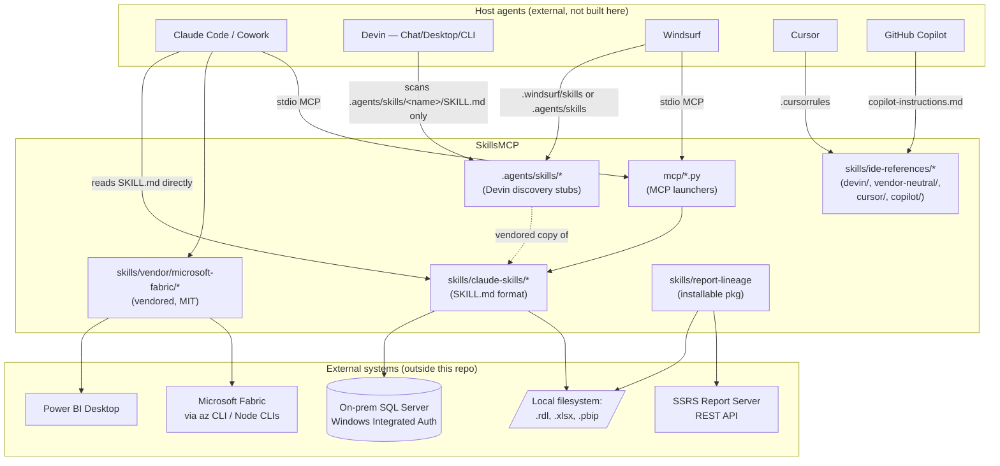
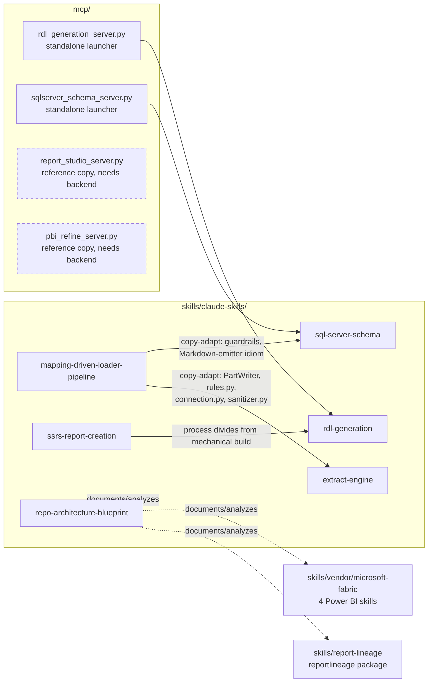
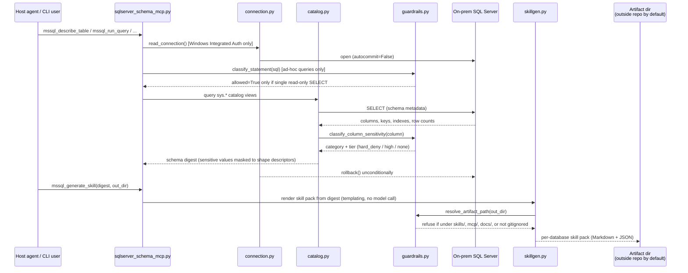
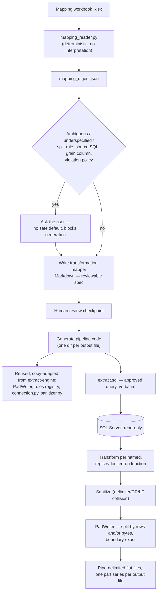
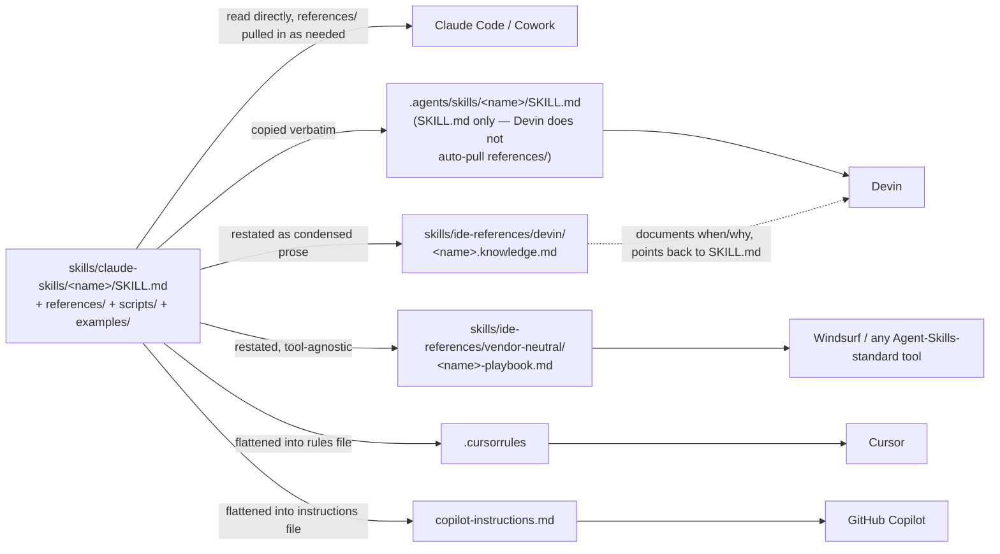

# SkillsMCP — Architecture Blueprint

Generated by the `repo-architecture-blueprint` skill
(`skills/claude-skills/repo-architecture-blueprint/SKILL.md`), run against
**this repository** as the worked example for that skill. See the
[Generation Footer](#15-generation-footer) for exactly what was analyzed.

This repository already carries deep, source-verified component
documentation (`README.md`, `docs/COMPONENT-GUIDE.md`, `docs/components/*.md`,
`skills/ASSESSMENT.md`) — that material goes module-by-module and
function-by-function and is the authority on exact signatures and flags. This
blueprint is complementary: it is the architecture-level reading (stack,
pattern, boundaries, data flow, cross-cutting concerns) the per-component docs
don't set out to give in one place.

---

## 1. Overview & Detected Stack

**This is not a deployed application.** There is no server that stays running,
no frontend, no build pipeline, no CI config (`.github/` does not exist), no
root-level `package.json`/`requirements.txt`. The repository is a **toolkit of
independently runnable pieces**, organized as "skills": self-contained folders
that pair a markdown specification (`SKILL.md`) with the scripts it describes,
consumed either by an agentic coding tool reading the spec, or by a human
running the scripts directly.

Evidence for the stack, in the order it was found:

| Signal | What it shows |
| --- | --- |
| No root manifest; only `skills/report-lineage/pyproject.toml` | Only one component (`report-lineage`) is packaged as an installable Python distribution. Everything else is a plain script tree run in place. |
| `mcp/*.py`, `skills/claude-skills/*/scripts/*.py` | Python 3.9–3.13 (tests carry `cpython-313` bytecode; `sql-server-schema`'s guardrails target 3.9+ typing). Stdlib-first by explicit convention (see [§6](#6-architectural-layers--dependencies)); `pyodbc`, `fastmcp`, `sqlglot`, `openpyxl`, `polars` appear only where a specific skill needs them. |
| `*/SKILL.md` YAML frontmatter (`name`, `description`, `allowed-tools`, `triggers`) | Markdown-with-frontmatter is a real control-plane artifact here, not just documentation — it drives which host agent auto-selects which skill. |
| `.rdl` (SSRS XML), T-SQL, `.xlsx` mapping workbooks, PBIP/TMDL | The *domain* data this toolkit operates on: SSRS reports, SQL Server schemas, Excel-authored field mappings, and Power BI projects — never a database of the toolkit's own. |
| `skills/vendor/microsoft-fabric/` | A verbatim MIT-licensed vendor drop from `microsoft/skills-for-fabric`, not built here. |
| `.agents/skills/`, `skills/ide-references/` | Multiple parallel *distribution* formats for the same skill content, one per consuming tool (see [§9](#9-service-communication-patterns)). |

**Primary stack(s) and roles:**

- **Python 3.9+ (up to 3.13 observed)** — the implementation language for
  every runnable piece: CLIs, MCP servers, generators, validators, a real
  pytest suite under three of the skills.
- **Markdown + YAML frontmatter** — the skill specification format
  (`SKILL.md`) and its IDE-specific derivatives; this is read by agents as
  much as by humans.
- **T-SQL** (read-only, via `pyodbc`/`sqlglot`) — the language `sql-server-schema`
  and the generated `mapping-driven-loader-pipeline` output speak to SQL
  Server; never written by this repo, only read and classified.
- **SSRS RDL XML** and **Power BI PBIP/TMDL** — file formats generated,
  validated, or migrated between by `rdl-generation`, `report-lineage`, and
  the vendored Microsoft skills; not "code" in the traditional sense but a
  first-class data shape this repo manipulates.
- No JavaScript/TypeScript, no compiled language, and no container/orchestration
  layer own by this repo (the vendored Microsoft skills call external Node
  CLIs and `az`, but those tools are not vendored here).

---

## 2. Architectural Pattern

There is no single named pattern (MVC, Clean Architecture, microservices)
because there is no single application. The pattern that actually fits, read
from the folder shape and the dependency direction, is a **skill-oriented,
ports-and-adapters-at-the-meta-level monorepo**:

- Each **skill** (`skills/claude-skills/<name>/`) is a self-contained "port":
  `SKILL.md` (the contract/spec) + `scripts/` (the implementation) +
  `references/` (deep documentation) + `examples/` (golden fixtures).
- Each **host agent** (Claude Code, Devin, Windsurf, Cursor, GitHub Copilot)
  is a "driving adapter" that discovers and invokes skills through its own
  mechanism — never a shared runtime, never a shared process.
- **`mcp/`** is a second adapter layer: thin launcher scripts that expose a
  subset of skills over the Model Context Protocol (stdio), so any
  MCP-speaking client gets the same tools a Claude-Code-style skill loader
  would get by reading `SKILL.md` directly.

Inside almost every Python skill, one further, consistent micro-pattern
recurs (found independently in `sql-server-schema`, `extract-engine`, and
`mapping-driven-loader-pipeline`): an **entrypoint layer** (`cli.py` /
`*_mcp.py`) → **domain modules** (`connection.py`, `catalog.py`, `analyze.py`,
`rules.py`, `execution_*.py`) → a **guardrails module** that every entrypoint
funnels through before any read or write happens. That guardrails module is
the closest thing this repo has to an enforced architectural boundary — see
[§8](#8-cross-cutting-concerns).

**Where the "pattern" is only partially followed:** `sql-server-schema`'s
guardrails/connection/rules shape is *reused* by `extract-engine` and
`mapping-driven-loader-pipeline`, but by **copy-and-adapt**, documented in
prose (`references/reuse-existing-generators.md`), not by importing a shared
package — there is no shared library and no lint rule that would catch one
skill's copy drifting from another's. Call this what it is: a *convention*,
not an *enforced* boundary. That is a legitimate choice for skills meant to be
handed to other teams as standalone trees (stated explicitly in
`mapping-driven-loader-pipeline/SKILL.md`), but it means "shared code" here
can silently fork.

---

## 3. Architecture Diagrams

### 3.1 System context — who discovers what, and what's outside the repo

**Reading this diagram:** the only two things that leave the repository at
runtime are (a) a read-only SQL Server connection opened by
`sql-server-schema` / the pipelines `mapping-driven-loader-pipeline`
generates, and (b) an optional SSRS Report Server REST call from
`report-lineage`'s estate scanner. Everything else is local file I/O. No
component in this repo makes a cloud AI API call — `report_studio_server.py`
(reference copy) goes further and actively refuses to start if a cloud AI key
is present in its environment (`ENFORCE_NO_EGRESS`).

### 3.2 Component / container diagram

Dashed boxes (`M3`, `M4`) mark the two components that are *documentation of
a design*, not runnable code in this repository — they import a
`backend/app/core/*` tree that was not carried over. `docs/minimal-backend-keep-set.md`
is the recorded plan for closing that gap if someone chooses to.

---

## 4. Data Flow Diagrams

Per the skill's own rule, materially different flows are diagrammed
separately rather than merged. Three representative flows follow; a fourth
(`report-lineage`'s estate scan) is described in prose since it is a fan-in
rather than a linear pipeline.

### 4.1 SQL Server schema discovery → digest → skill pack (`sql-server-schema`)

**What makes this flow trustworthy rather than merely functional:** every
read is a single classified SELECT inside a transaction that is always rolled
back (a parser can be fooled; an unconditional rollback cannot), every column
name is pattern-matched for PII/PHI before its value is ever returned, and the
output path is refused outright if it would land inside a committed folder.

### 4.2 Mapping document → transformation mapper → generated pipeline (`mapping-driven-loader-pipeline`)

The step this diagram exists to make visible: **generation is gated on a
human-reviewable Markdown artifact**, not a direct workbook-to-code
translation. That gate (`F` → `G`) is the architectural decision this skill
is built around, not an incidental step.

### 4.3 Skill content → host agent (the repo's own "data flow")

This flow is worth diagramming because it is a real, load-bearing fact about
this repo, not boilerplate: **the same skill content is deliberately
re-derived into up to four different shapes** because no two of these tools
read the same discovery format, and `docs/components/vendor-and-ide-references.md`
already flags that this repo has **no single documented mechanism for how the
`.knowledge.md` files actually get loaded into a Devin session** — distinct
from the `.agents/skills/` vendoring path, which *is* documented. Treat that
as a known gap, not a solved problem.

---

## 5. Components

| Component | Purpose | Boundary evidence |
| --- | --- | --- |
| `skills/claude-skills/sql-server-schema/` | Read-only SQL Server schema discovery, digesting, and skill-pack generation | Only component with `assert_no_credentials`; the guardrails module other skills copy from |
| `skills/claude-skills/extract-engine/` | Metadata-driven engine: `meta.*` tables → pipe-delimited flat files, two execution backends (Polars / generated SQL view) required to match byte-for-byte | Largest test suite (11 files); explicitly labeled a **prototype from a design prompt**, with two documented gaps (`extract benchmark`, an authoring MCP server) that don't exist in code |
| `skills/claude-skills/mapping-driven-loader-pipeline/` | Turns an Excel mapping document into a reviewable mapper + generated pipeline, reusing `extract-engine` | Explicitly copy-adapts rather than imports from `extract-engine` and `sql-server-schema` — a documented, not enforced, dependency |
| `skills/claude-skills/rdl-generation/` | Dependency-free (stdlib-only) SSRS `.rdl` builder + 10-check validator | No dependency on any other skill; wrapped as-is by `mcp/rdl_generation_server.py` |
| `skills/claude-skills/ssrs-report-creation/` | Pure process/workflow guidance (no scripts) for authoring SSRS reports | Explicitly divides labor with `rdl-generation`: process vs. mechanical build/validate |
| `skills/claude-skills/repo-architecture-blueprint/` | This skill — repo-agnostic architecture/blueprint generation | New in this branch; the only skill whose subject is other repositories in general, not this repo's own domain (SSRS/Power BI/SQL Server) |
| `skills/report-lineage/` | Standalone installable package: SSRS estate lineage, duplicate detection, search, export, across RDL/DTSX/conmgr/SQL sources and filesystem/git/report-server scanners | The **only** component with a `pyproject.toml` and a conventional `tests/` package layout — architecturally isolated from `skills/claude-skills/*` |
| `skills/vendor/microsoft-fabric/` | Four vendored Microsoft Power BI authoring skills (planning → design → authoring → management) | Verbatim MIT copy; explicitly "not built here" per `README.md`'s provenance section |
| `skills/ide-references/` | Non-Anthropic-format restatements of the same skills, one subfolder per consuming tool | `devin/`, `vendor-neutral/`, `cursor/`, `copilot/` — confirmed by `docs/components/vendor-and-ide-references.md` to be genuine restatements, not independent specs |
| `mcp/` | Four MCP server launchers over the Model Context Protocol | Two run standalone (`rdl_generation_server.py`, `sqlserver_schema_server.py`); two are reference copies needing an uncommitted `backend/app/core/*` tree |
| `.agents/skills/` | Devin's actual discovery path | Verbatim `SKILL.md` copies only — Devin's loader does not pull in a skill's `references/`, which is why the source repo has to be in Devin's workspace too |
| `docs/` | Design prompts and integration guides (not component reference material) | Explicitly out of scope for `COMPONENT-GUIDE.md`'s per-module documentation |

---

## 6. Architectural Layers & Dependencies

**The enforced boundary:** `_NEVER_WRITE = ("skills", "mcp", "docs")` in
`sql-server-schema/scripts/guardrails.py`'s `resolve_artifact_path()` — the one
dependency rule in this repo that is checked in code rather than only stated
in prose. Anything that would name internal servers/databases/columns is
refused if it would land in a committed folder, full stop.

**The conventional (unenforced) boundaries:**

- `mapping-driven-loader-pipeline` and `extract-engine` → depend on
  `sql-server-schema`'s guardrails/connection shape, by copy, not import.
- `ssrs-report-creation` → depends on `rdl-generation` for the mechanical
  build/validate step; itself ships no code.
- `mcp/*_server.py` → thin launchers that import their skill's `scripts/` by
  inserting it onto `sys.path`; **no two skills may both ship a
  `mcp_server.py` module name**, which is *why* the SQL Server one is named
  `sqlserver_schema_mcp.py` rather than `mcp_server.py` — a real constraint
  this repo's structure forces, not a stylistic choice.
- `report-lineage` → depends on nothing else in this repository. It is the
  one place a real package boundary (installable, tested, no `sys.path`
  tricks) exists.

**A layering trap already discovered and documented in this repo's own
material** (not this blueprint's finding — carried over from
`mcp/README.md`): the folder `mcp/` collides with the PyPI package `mcp` that
`fastmcp` itself depends on. Whenever the repository root is on `sys.path`,
`import mcp` silently resolves to this folder instead of the real dependency.
The chosen fix is procedural (launch by absolute path, never
`python -m mcp.<name>` from the root) rather than renaming the folder — worth
knowing before assuming a `ModuleNotFoundError` there is a missing
dependency.

---

## 7. Data Architecture

This repository **owns no persistent data store of its own.** What passes
through it:

- **SQL Server schemas** (external, read-only) — accessed via `pyodbc`,
  classified by `sqlglot`-first/regex-always parsing in `guardrails.py`,
  never written to (`autocommit=False`, unconditional `rollback()`).
- **Excel mapping workbooks** (`.xlsx`, via `openpyxl`) — read
  deterministically, field-name/alias normalized, never interpreted beyond a
  digest.
- **SSRS `.rdl` XML** — built and validated by stdlib `xml.etree`-class
  tooling in `rdl-generation`; read (never written) by `report-lineage`'s
  parser layer for lineage extraction.
- **Power BI PBIP/TMDL projects** — written by the vendored Microsoft skills
  and (per reference-only servers) `report_studio_server.py`/`pbi_refine_server.py`.
- **Generated artifacts** (schema digests, skill packs, mapping digests,
  transformation mappers, generated pipelines) — all routed through
  `resolve_artifact_path()`, defaulting to a location **outside** the
  repository (`%LOCALAPPDATA%`/`XDG_DATA_HOME`-style path), because they name
  real internal identifiers and this repository is public.

**Validation, not caching, is the dominant data-architecture concern here** —
there is no cache layer anywhere in this repo (nothing here serves repeated
requests at a rate that would justify one). Instead:

- `guardrails.classify_column_sensitivity` / `value_looks_sensitive` — a
  name-pattern **and** value-shape (regex + Luhn-checked card numbers)
  classifier, explicitly documented as "a candidate classifier and a safety
  net, not a compliance control."
- `rdl-generation/validate_rdl.py` — 10 structural checks against generated
  XML before it's treated as valid.
- `mapping_reader.py` — digest-level error/warning/info counts, non-zero
  exit code on error, so a bad read fails a script rather than passing
  silently downstream.

---

## 8. Cross-Cutting Concerns

**Authentication & authorization.** Windows Integrated Auth only, for the one
component that touches a live external system with credentials
(`sql-server-schema`). No password parameter exists anywhere in that API, and
a build-time assertion (`assert_no_credentials`) fails if one is ever added.
Everything else needs no authentication because it operates on local files.

**Error handling & resilience.** No retry/circuit-breaker patterns — these
are single-shot local tools, not long-running networked services under load,
so that category of resilience doesn't apply. The resilience pattern that
*does* recur is **refuse rather than degrade**: unconditional transaction
rollback, hard refusal to write into `skills/`/`mcp`/`docs/`, hard refusal on
any SQL statement that isn't a lone classified `SELECT`, and (per
`mcp/README.md`) `report_studio_server.py`'s `ENFORCE_NO_EGRESS` refusing to
even start if a cloud AI key is present.

**Logging & observability.** Thin by design: `mapping-driven-loader-pipeline`
generates a per-run manifest (`run_log.py` — parts, counts, checksums) inside
the *generated* pipelines; the skills themselves rely on CLI stdout
(`--report` summaries, dry-run output) rather than structured logging,
consistent with there being no long-running process to observe.

**Validation.** Split across the two places it matters: input validation at
the read boundary (`mapping_reader.py`'s digest, `guardrails.classify_statement`)
and output validation at the generation boundary (`validate_rdl.py`,
`extract-engine`'s two execution backends being required to produce
byte-identical output as a cross-check on each other).

**Configuration management.** Environment-variable driven, declared in
`.mcp.json`: `SQLSERVER_MCP_SERVER`, `SQLSERVER_MCP_DATABASE`,
`SQLSERVER_MCP_MAX_ROWS`, plus `SQLSERVER_MCP_ARTIFACT_DIR` and
`SQLSERVER_MCP_ALLOW_REPO_WRITES` (both read directly in `guardrails.py`).
No secrets vault, no `.env` committed (`.gitignore` excludes `.env`) — there
is nothing to store a secret for, since auth is Windows-identity-based.

**PII/PHI handling — the standout cross-cutting concern of this repository.**
`guardrails.py`'s `HARD_DENY` set (SSN, national ID, payment card, passport,
driver's license, patient record, credential) and its broader
`_SENSITIVE_PATTERNS` table are the most heavily engineered piece of logic in
the entire codebase, and they match this organization's stated data-handling
policy on SSN/Aadhaar/PAN/passport/license/card/patient-record data almost
verbatim. Every column name is normalized (camelCase and separators folded
together) before matching, and every sensitive value is returned as a shape
descriptor (`{masked, len, shape}`) rather than the value itself — the value
never leaves the database.

---

## 9. Service Communication Patterns

Not client/server in the networked sense; the only "service" boundary is
**stdio Model Context Protocol**, opened by a host IDE/agent to one of the
launchers in `mcp/`. Two of the four launchers are fully runnable
(`rdl_generation_server.py`, `sqlserver_schema_server.py`); every tool on
every server is also a plain, directly callable Python function with no MCP
client involved at all — the protocol is an optional transport, not a
requirement to use any of the logic.

There is no versioning scheme for the MCP tool surfaces themselves. The
closest thing to a version contract in this repo is prose: the vendored
Microsoft skills are pinned by commit (`d79f339`, v0.3.9) in
`docs/devin-windsurf-microsoft-skills-integration.md`, and this folder's own
`README.md` states it is "a snapshot, not a live link" to its source
repository — re-copying is a manual, undated operation.

---

## 10. Testing Architecture

Testing depth is uneven across components, which is itself informative:

| Component | Test shape |
| --- | --- |
| `extract-engine` | Full pytest suite, 11 files, covering checkpoint/resume, both execution backends, guardrails, memory ceiling, rule conformance |
| `report-lineage` | Full pytest suite with `tests/fixtures/` (sample `.rdl`/`.dtsx`/`.conmgr`/`.sql`), the only component with a `conftest.py` |
| `rdl-generation` | No pytest suite; validated by running `validate_rdl.py` against 5 committed example `.rdl` files that must pass all 10 checks — golden-example testing, not unit testing |
| `mapping-driven-loader-pipeline` | Ships no tests of its own scripts, but **generates** a test suite (`test_<file>_transforms.py`, `test_part_writer_split.py`) as part of every pipeline it produces — testing is templated into the output, not present in the generator |
| `sql-server-schema` | Tested indirectly through `extract-engine`'s `test_connection.py`/`test_guardrails.py`, since those modules were copy-adapted from it; no independent test file for the schema-discovery tools themselves in this tree |
| `ssrs-report-creation` | No scripts, so no tests — pure process documentation |

Test doubles follow one recurring shape: an injectable `conn=` seam in
`connection.py` (both the `sql-server-schema` original and the
`extract-engine` copy) is what lets the offline test suites run without a
real SQL Server.

---

## 11. Deployment Architecture

There is no deployment topology to document in the usual sense — no CI/CD
config, no container image, no IaC, no environment-specific settings beyond
the MCP env vars in [§8](#8-cross-cutting-concerns). "Deployment" for this
repository means one of:

1. **Vendoring a skill folder** into a consuming host's discovery path
   (`.agents/skills/<name>/`, `.windsurf/skills/<name>/`) — a `git`
   copy-and-commit operation, not a build/release.
2. **Running an MCP server locally**, launched by the consuming IDE via
   `.mcp.json` (this repo ships its own, wiring `rdl-generation` and
   `sql-server-schema`).
3. **Installing `report-lineage`** as a normal Python package
   (`pip install -e .`) and running its CLI.

The two reference-only MCP servers are the one place a real deployment gap is
already documented: `docs/minimal-backend-keep-set.md` records the smallest
slice of an external backend (`backend/app/core/*`) someone would need to
vendor to make `report_studio_server.py`/`pbi_refine_server.py` deployable
here at all.

---

## 12. Extension & Evolution Patterns

- **Adding a new skill**: follow the shape every existing `claude-skills/*`
  entry uses — `SKILL.md` with the same frontmatter fields (`name`,
  `description`, `allowed-tools`, `triggers`), then `scripts/`, `references/`,
  `examples/` as needed. Add a `.agents/skills/<name>/SKILL.md` copy and a
  `skills/ide-references/devin/<name>.knowledge.md` pointer if Devin should
  discover it (this blueprint's own skill, `repo-architecture-blueprint`, was
  added exactly this way in the immediately preceding change).
- **Reusing code across skills**: the established convention is copy-adapt
  with an explicit, stated choice recorded in the generated/consuming
  skill's own docs (see `mapping-driven-loader-pipeline`'s "copy vs. import"
  note) — not a shared package. A new skill that wants `sql-server-schema`'s
  guardrails should follow that same explicit-choice convention rather than
  quietly importing across skill folders.
- **Extending guardrails**: `guardrails.py`'s `_SENSITIVE_PATTERNS` and
  `_NEVER_WRITE` are the two lists to extend first for a new sensitive-data
  category or a new protected output path; both are plain Python
  collections, not configuration files, so extending them is a code change
  reviewed like any other.
- **Common pitfall already on record**: shipping a second `mcp_server.py`
  module name anywhere under `skills/*/scripts/` will collide with an
  existing one in `sys.modules` once both are launched in the same
  interpreter — name every new MCP entrypoint file uniquely, the way
  `sqlserver_schema_mcp.py` already had to be.

---

## 13. Architectural Decision Records

**ADR-1: Markdown mapper before code generation (`mapping-driven-loader-pipeline`).**
*Context*: a mapping document's transformation rules are prose, and
misreading one produces a wrong loader file discovered only when a vendor
rejects a transmission. *Decision*: never go straight from workbook to code;
require a reviewable Markdown artifact, quoting every rule verbatim beside
its interpretation, as a mandatory checkpoint. *Consequence*: slower
time-to-code, but a wrong reading is caught by a human who never has to read
Python.

**ADR-2: copy-adapt over shared import, across skills.** *Context*: several
skills need the same read-only-connection, rule-registry, and
delimiter-sanitizing logic. *Decision*: copy the code into each new skill and
adapt it, recording the choice in that skill's README, rather than factoring
it into a shared installable package. *Consequence*: a generated pipeline can
be handed to another team as a standalone tree with no dependency on this
repository — the explicit reason given in
`mapping-driven-loader-pipeline/SKILL.md` — at the cost of no compiler- or
lint-enforced guarantee that the copies stay in sync.

**ADR-3: generated artifacts default outside the repository.** *Context*: schema
digests, skill packs, mapping digests, and transformation mappers all name
real internal servers, databases, tables, and columns, and this repository is
public. *Decision*: `resolve_artifact_path()` refuses `skills/`, `mcp/`,
`docs/` unconditionally, and defaults every output path to a machine-local
directory outside the git work tree. *Consequence*: the only mapping/schema
artifacts safe to commit here are the explicitly fictional ones under each
skill's `examples/`.

**ADR-4: two execution backends, required to agree, in `extract-engine`.**
*Context*: a Polars in-process execution path and a generated-SQL-view
execution path could each independently have subtle bugs. *Decision*: treat
byte-identical output between the two as the correctness bar, rather than
trusting either one alone. *Consequence*: a real cross-check exists, at the
cost of maintaining two execution paths for one logical feed.

**ADR-5: report-lineage packaged; everything else is a script tree.**
*Context*: `report-lineage` is meant to be installed and run as a scan tool
against an arbitrary SSRS estate, independent of this repository's own
lifecycle. *Decision*: give it its own `pyproject.toml`, its own test
package, and no dependency on `skills/claude-skills/*`. *Consequence*: it is
the one component here that could be published or vendored on its own
without carrying this repository along with it — worth treating as the
template if another component here later needs the same independence.

---

## 14. Blueprint for New Development

**Starting a new SSRS/Power BI/SQL-Server-facing skill:** start from
`skills/claude-skills/mapping-driven-loader-pipeline/` as the fullest
worked template — it shows the frontmatter shape, the references/scripts/examples
split, a DEVIN-USAGE.md, and the explicit reuse-and-attribution pattern
described in ADR-2. Add the `.agents/skills/<name>/SKILL.md` stub and a
`skills/ide-references/devin/<name>.knowledge.md` pointer in the same change,
not as a follow-up — the discovery-path fan-out in
[§4.3](#43-skill-content--host-agent-the-repos-own-data-flow) means a skill
without both is invisible to Devin even though it's fully documented for
Claude Code.

**Starting a new repo-agnostic skill** (like this one): keep every
repo-specific fact out of the skill body itself — `repo-architecture-blueprint`'s
own "Reusability contract" section is the pattern to copy: state the contract
explicitly, then hold the skill to it.

**Testing expectations for new scripts:** match `extract-engine`'s or
`report-lineage`'s shape (a real `tests/` package, an injectable `conn=`
seam for anything touching SQL Server), not `rdl-generation`'s
golden-example-only shape — the latter works because RDL output is easy to
validate structurally; a new skill with less externally-checkable output
should default to unit tests.

**Common pitfalls to avoid**, all already on record in this repository:

- Don't add a second `mcp_server.py`-named module under any skill's `scripts/`
  (see [§6](#6-architectural-layers--dependencies)).
- Don't write a generated artifact's default path inside `skills/`, `mcp/`,
  or `docs/` — `resolve_artifact_path()` will refuse it, by design.
- Don't assume `python -m mcp.<name>` works from the repository root — it
  will shadow the real `mcp` PyPI package `fastmcp` depends on.
- Don't treat `guardrails.classify_column_sensitivity` as a compliance
  certification — it is documented as a safety net, and a column it doesn't
  flag can still hold sensitive data.

---

## 15. Generation Footer

- **Generated**: 2026-09-13
- **Repository analyzed**: `SkillsMCP` (local working copy)
- **Branch**: `sqlmcp`
- **Commit analyzed**: `f6f4afc53340ade26d4f4ec40b8b122d9982cc2d`
  (`f6f4afc` — "Add full component documentation and extract-engine skill
  docs"), **plus** uncommitted working-tree additions at analysis time:
  `.agents/`, `skills/claude-skills/repo-architecture-blueprint/`,
  `skills/claude-skills/extract-engine/DEVELOPER.md`,
  `skills/ide-references/devin/mapping-driven-loader-pipeline.knowledge.md`.
  Re-run against a clean commit if you need a blueprint that excludes
  uncommitted state.
- **Detail level**: Detailed
- **Diagram notation**: Mermaid (`graph`, `sequenceDiagram`, `flowchart`) —
  chosen for inline rendering on GitHub/most agent surfaces with no plugin
- **Code examples**: included, pulled verbatim from source (none invented)
- **Architectural decision records**: included ([§13](#13-architectural-decision-records))
- **External diagram-tool hand-off**: not used — every diagram's Mermaid
  source lives in its own fenced block above and can be lifted into another
  renderer if a specific tool is later named (see the skill's Step 7)
- **How to regenerate**: re-invoke the `repo-architecture-blueprint` skill
  against this repository; diff the new file against this one to see what
  changed since this commit
