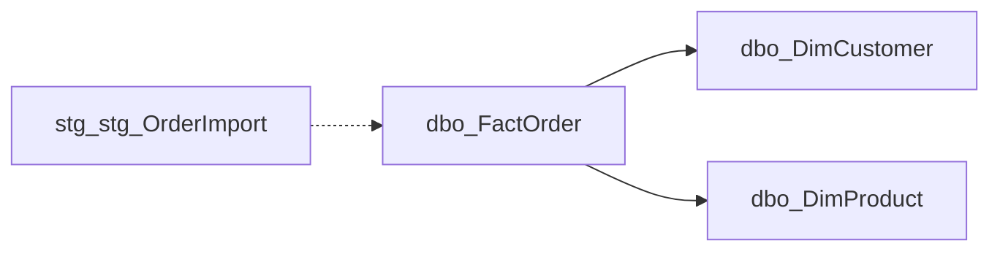

# Join graph

3 relationships in total, 3 shown here (tier 1 and tier 2 tables). Declared foreign keys are enforced by the database; inferred edges are name matches and should be verified before you rely on them.

| From | To | On | Confidence |
| --- | --- | --- | --- |
| `dbo.FactOrder` | `dbo.DimCustomer` | CustomerId = CustomerId | declared |
| `dbo.FactOrder` | `dbo.DimProduct` | ProductId = ProductId | declared |
| `stg.stg_OrderImport` | `dbo.FactOrder` | OrderId = OrderId | inferred |

## Join clauses

```sql
-- dbo.FactOrder -> dbo.DimCustomer
INNER JOIN dbo.DimCustomer AS r ON t.CustomerId = r.CustomerId
-- dbo.FactOrder -> dbo.DimProduct
INNER JOIN dbo.DimProduct AS r ON t.ProductId = r.ProductId
-- stg.stg_OrderImport -> dbo.FactOrder  -- inferred, verify
INNER JOIN dbo.FactOrder AS r ON t.OrderId = r.OrderId
```

## Diagram


